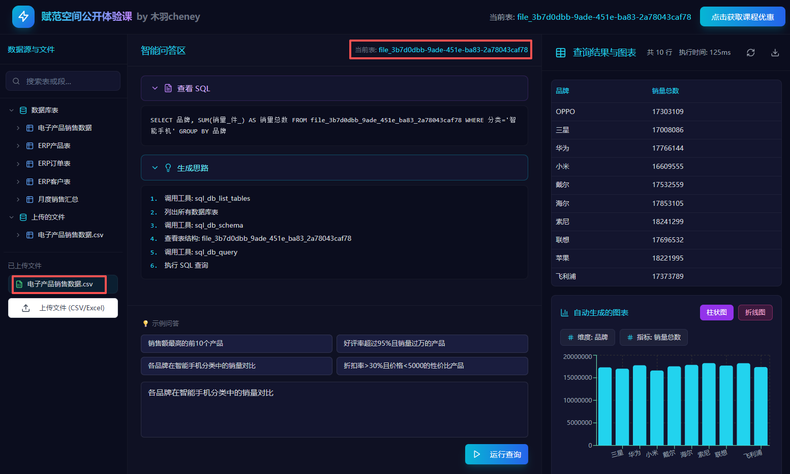
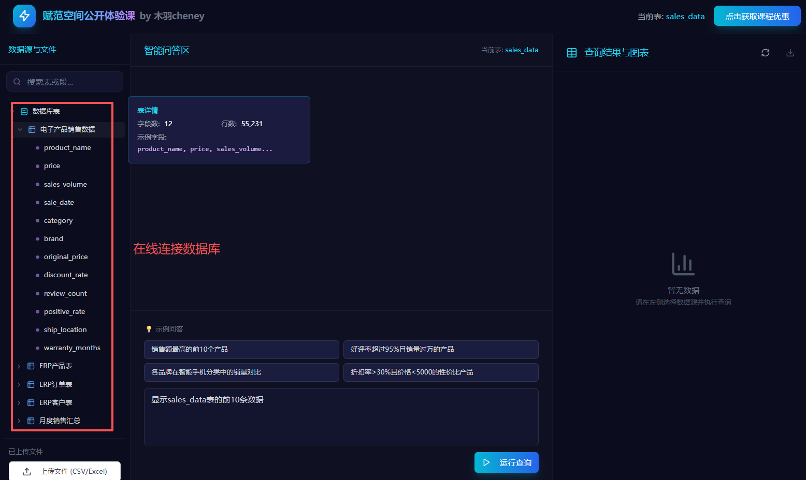
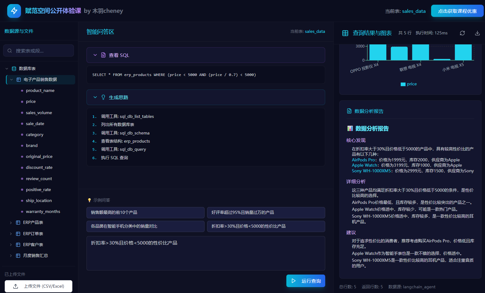

<div align="center">
  <h1>🚀 NL2SQL Data Analysis System Powered by LangChain</h1>
  <p><em>Make data analysis as easy as chatting</em></p>
  <span>English | <a href="./README_zh.md">中文</a></span>
</div>

## ⚡ Project Overview

This project is an NL2SQL data analysis system built on **LangChain 1.0**, using FastAPI + React.

You can use natural language to query, aggregate, and visualize data from a database or uploaded CSV/Excel files. No SQL needed — charts and results are generated automatically.


## 🎯 Key Features

### 🔍 Data Processing & Ingestion
- Batch upload `.csv` / `.excel` files, automatically parse and ingest into a temporary database, support data retrieval, visualization, and detailed analytical report generation based on the file contents.
- Automatically extract headers, estimate row counts, and other basic metadata to support quick exploration.
<div align="center"></div>

### 🤖 Natural Language to SQL (NL2SQL)
- Integrates LangChain SQL Agent to automatically convert natural language into SQL queries.
- Supports connecting to local/cloud databases, selecting tables, and asking questions in natural language.
<div align="center"></div>

### 📈 Data Visualization
- Choose single-table or multi-table automatic analysis; the system generates SQL queries in real time and executes them, then builds visualizations based on the query results.
<div align="center"></div>

## 🎥 Demo


https://github.com/user-attachments/assets/d589470f-8bf9-41a9-a313-2d0d4c04f9c4


## 📁 Project Structure

```
├── backend/                 # Backend (FastAPI + LangChain)
│   ├── app/                 # Core app (routes, Agent, visualization)
│   ├── data/                # Data directory (uploads & visualization outputs)
│   ├── requirements.txt     # Python dependencies
│   ├── api_with_db.py       # Launch script (with temporary DB)
│   └── .env                 # Environment variables (recommended here)
├── frontend/                # Frontend (React + Vite)
│   ├── src/                 # Pages & components
│   └── package.json         # Node project configuration
└── README.md
```


## 🚀 Quick Start


### 1. Configure Environment Variables (`.env` file)

Create and fill `backend/.env` with:

```
OPENAI_API_KEY=sk-your-api-key
OPENAI_BASE_URL=https://api.openai.com/v1
DEFAULT_MODEL=gpt-4o-mini
```

### 2. Start the Backend Service

```bash
# 1. Enter the backend directory
cd backend

# 2. Create and activate a virtual environment
python -m venv venv
source venv/bin/activate  # Linux/Mac
# or
venv\Scripts\activate     # Windows

# 3. Install dependencies
pip install -r requirements.txt

# 4. Start the service
python api_with_db.py
```


### 3. Start the Frontend Service

```bash
# 1. Enter the frontend directory
cd frontend

# 2. Install dependencies
npm install

# 3. Start the dev server
npm run dev
```


## 🙈 Contributing
We welcome contributions via PRs and issues on GitHub. Contributions of all kinds are appreciated — feature improvements, bug fixes, and documentation enhancements.

## 😎 Community
Explore our tech community 👉 [LLM Tech Community | Fanfan Space](https://kq4b3vgg5b.feishu.cn/wiki/JuJSwfbwmiwvbqkiQ7LcN1N1nhd)

Scan to add our assistant and reply with “NL2SQL” to join the tech discussion group.
<div align="center">

</div>
